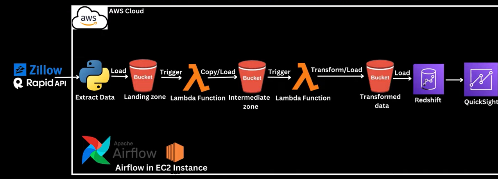

# Zillow-Data-Analysis-DataEngineering-Project
In this data engineering project, we build and automate a python ETL process that would extract real estate properties data from Zillow Rapid API, loads it unto amazon s3 bucket which then triggers a series of lambda functions which then ultimately transforms the data, converts into a csv file format and load the data into another S3 bucket using Apache Airflow. Apache airflow will utilize an S3KeySensor operator to monitor if the transformed data has been uploaded into the aws S3 bucket before attempting to load the data into an amazon redshift. 
After the data is loaded into aws redshift, then we will connect amazon quicksight to the redshift cluster to then visualize the Zillow (rapid data) data.

# TechStack Used
    - Python
    - Airflow
    - AWS S3
    - AWS Lambda
    - AWS EC2- t2.medium, ubuntu
    - AWS Redshift
    - Zillow RapidAPI

# ArchitectureFlow

## Steps Followed::
    1. Create EC2 instance - t2.medium, ubuntu
    2. Installing dependencies on ec2 server
        - sudo apt install python3-pip
        - sudo apt install python3-venv
    3. Create virtual environment and activate the environment
        - python3 -m  venv zillowdataanalysis
        - source zillowdataanalysis/bin/activate
    4. Install awscli and apache-airflow
        - pip3 install awscli apache-airflow
    5. Initialize airflow
        - airflow standalone
    6. Login to the airflow UI using the public EC2 IPv4.
    7. Connect the code editor(in this case vs code) to ec2 instance .
        Refer to - https://www.youtube.com/results?search_query=how+to+connect+ec2+instance+to+vscode
    8. Get zillow API from Rapid API hub - https://rapidapi.com/s.mahmoud97/api/zillow56
    

